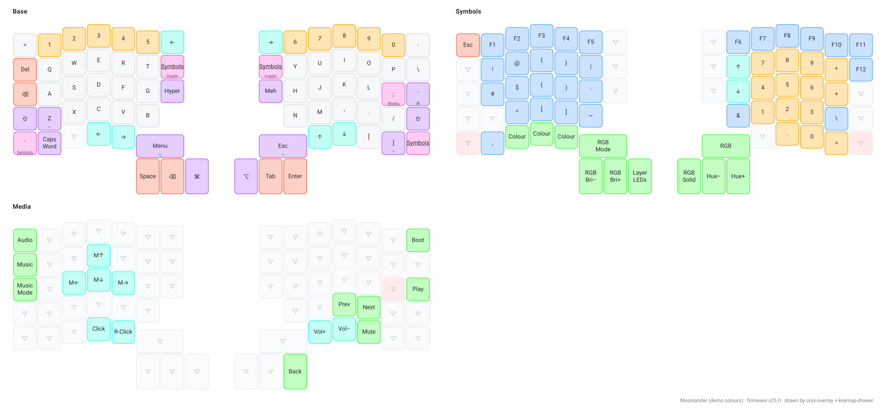
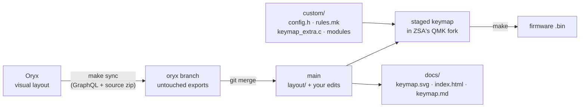
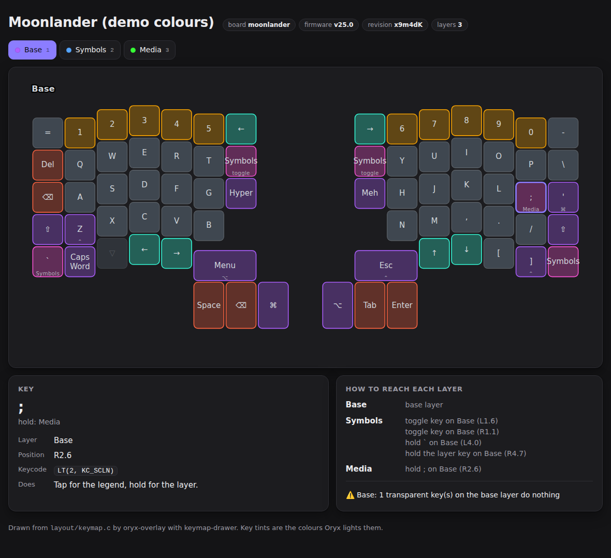
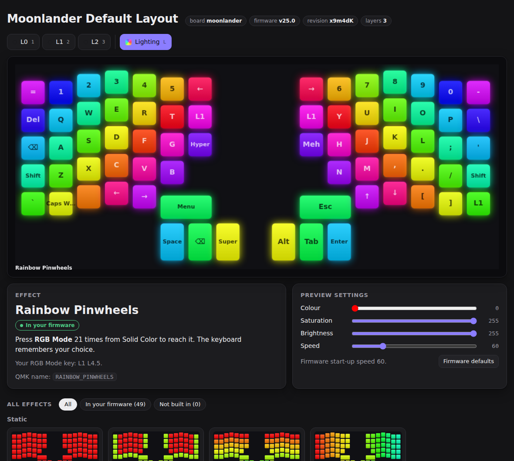

# oryx-overlay

**Design your ZSA keyboard in Oryx. Add the QMK features Oryx can't do. See the result drawn in your own LED colours.**

A template repo for Moonlander, Voyager, ErgoDox EZ and Planck EZ owners who like Oryx's visual editor but want Chordal Hold, combos, key overrides, community modules or custom C. The overlay runs in GitHub Actions or locally, and comes set up for [Claude Code](https://claude.com/claude-code).



<sub>ZSA's stock Moonlander layout with demo colours. Your repo draws your layout, tinted with the colours you set in Oryx.</sub>

## What you get

- **Two-way safe customisation.** Keep editing keys in Oryx. Your QMK code lives in `custom/`, which Oryx never touches, and is layered on at build time. For the rare edit that has to go inside Oryx's code, a git merge carries it across Oryx updates.
- **Firmware builds in CI.** Press *Run workflow* after changing your layout in Oryx, and a `.bin` ready for Keymapp is waiting in the artifacts. Local builds work the same way, natively or in Docker.
- **A keymap you can see.** Every build redraws `docs/keymap.svg` with [keymap-drawer](https://github.com/caksoylar/keymap-drawer), using your Oryx layer names and LED colours, plus `docs/index.html`, an interactive viewer you can publish with GitHub Pages.
- **A lighting effect picker.** Every RGB effect your board supports plays on your own layout, using a JavaScript port of QMK's effect code that CI checks byte for byte against the real firmware. It shows which effects your firmware actually includes, where your RGB Mode key is, and how to switch the rest on.
- **Readable history.** Oryx syncs are commits with key-level changelogs (`Base R1.3: W → F`), and `make diff` shows the same for any range.
- **Layout checks.** Unreachable layers, layer keys pointing nowhere, and layers you can enter but never leave are flagged on every build.
- **Claude Code ready.** `CLAUDE.md` explains the repo's rules, three skills cover syncing, adding features and reviewing the layout, and project permissions block flashing and edits to generated files.

## How it works



1. `scripts/oryx_fetch.py` asks Oryx's public GraphQL API for your layout's latest revision and downloads the same source zip as Oryx's *Download source* button.
2. The export is committed to the `oryx` branch, which only ever holds untouched Oryx output. Merging it into `main` replays just what you changed in Oryx on top of any edits in `layout/`. This is the approach [poulainpi/oryx-with-custom-qmk](https://github.com/poulainpi/oryx-with-custom-qmk) proved out.
3. `scripts/build.sh` resets ZSA's QMK fork (at the firmware version Oryx used) to its branch, copies `layout/` into it, appends `custom/` through `#include` and `-include` lines in that staging copy, stages the template's `modules/` and your `custom/modules/` in a QMK userspace, and compiles.

## Quick start

1. **Create your repo:** click **Use this template** on GitHub. The `oryx` branch is created on first sync, so there's nothing else to copy.
2. **Make your Oryx layout public** (layout settings → privacy) and copy its ID from the URL:
   `https://configure.zsa.io/moonlander/layouts/`**`AbC12`**`/latest/0`
3. **Edit `oryx.conf`:** set `ORYX_LAYOUT_ID`, and set `KEYBOARD` to your board. Moonlander owners, check your revision: in bootloader mode, revision A shows up as *STM32 Bootloader* and revision B (shipping since mid-December 2025) as *Moonlander Bootloader*.
4. **Sync:** Actions → **Sync from Oryx** → *Run workflow*. It pulls your layout, merges it, builds the firmware and redraws `docs/`.
5. **Flash:** download the artifact from the run and flash it with [Keymapp](https://www.zsa.io/flash).

From then on: change keys in Oryx → run **Sync from Oryx** (or `make sync && make build`) → flash.

> Out of the box the template points at ZSA's stock Moonlander layout (`ORYX_LAYOUT_ID=default`), so CI is green before you change anything.

## Adding QMK features

Put your changes in `custom/`. Nothing there can conflict with an Oryx export.

| File | Joins the build as | Use it for |
|---|---|---|
| `custom/config.h` | `#include` at the end of Oryx's `config.h` | `CHORDAL_HOLD`, `FLOW_TAP_TERM`, tapping terms |
| `custom/rules.mk` | `-include` at the end of Oryx's `rules.mk` | `COMBO_ENABLE = yes`, `SRC += custom/...` |
| `custom/keymap_extra.c` | `#include` at the end of Oryx's `keymap.c` | Combos, key overrides, helpers |
| `custom/keymap.json` | `modules` merged into Oryx's list | Enabling [community modules](https://docs.qmk.fm/features/community_modules) |
| `custom/modules/<owner>/<name>/` | a per-build QMK userspace (`QMK_USERSPACE`) | Per-keypress logic without touching `process_record_user`. Same name as a bundled module in `modules/`? Yours wins. |

Example, home-row mods that stop misfiring:

```c
// custom/config.h
#define CHORDAL_HOLD
#define FLOW_TAP_TERM 150
#undef TAPPING_TERM          // Oryx defines it; undefine before redefining
#define TAPPING_TERM 190
```

If something truly has to live inside an Oryx callback, edit `layout/keymap.c` and mark each added line `// [custom]`. Git carries it across syncs; if Oryx rewrites the same lines, you resolve one merge conflict. `custom/README.md` has the full decision order.

> ZSA's QMK fork trails mainline QMK. Before relying on a feature, check it exists in `.cache/qmk_firmware-firmwareNN/` (the fork at your layout's firmware version).

## The visual keymap

Each build writes three views of your layout to `docs/`:

| File | For |
|---|---|
| `keymap.svg` | Every layer in one image, for your README or a wallpaper. `keymap-base.svg` is the base layer alone. |
| `index.html` | An interactive viewer: layer tabs (number keys switch), hover or tap any key to see its keycode, what it does and how each layer is reached. Follows your system's light or dark theme. |
| `keymap.md` | A text version with grids, layer access, checks and raw keycodes. Handy in diffs and for Claude. |

Keys are tinted with the colours you give them in Oryx, so the drawing looks like your board lit up. Layer names come from Oryx too.



**Publish the viewer:** Settings → Pages → *Deploy from a branch* → `main`, folder `/docs`. CI commits fresh drawings after every build on `main`, so the page stays current.

Set `LEGEND_STYLE=mac` in `oryx.conf` for ⌃ ⌥ ⇧ ⌘ legends instead of Ctrl/Alt/Shift/Super.

## Choosing a lighting effect

The viewer's **Lighting** tab (press `L`) is a picker for RGB Matrix effects. Oryx lists effects by name only; this plays them on your board.



- **The real effects.** `scripts/rgb_effects.js` is a line-by-line port of QMK's effect code, run on your board's LED map. It doesn't use recordings or approximations. For the 39 effects without randomness, every build compiles QMK's own C and checks the port matches it pixel for pixel. Reactive effects respond as you type on your keyboard or click keys.
- **What's in your firmware.** Effects are marked *in your firmware*, *turned off in Oryx* (Oryx's Advanced Settings › RGB adds `#undef` lines to `config.h`), or *not built in*. Effects you enable in `custom/config.h` count too.
- **How to get there.** For effects in your firmware: how many RGB Mode presses from Solid Color, and where your RGB Mode key is. For the rest: switch it on in Oryx, or copy the `#define ENABLE_RGB_MATRIX_…` line for `custom/config.h`.
- **Why you might not see it.** If Oryx key colours are set on your base layer, they repaint every LED (uncoloured keys go dark), so no effect shows until you press Toggle Layer Colors. The picker says so and names your toggle key. It also reports your `RGB_MATRIX_TIMEOUT`.
- **Your settings.** Colour, saturation, brightness and speed sliders start from your firmware's start-up values.

`docs/keymap.md` carries the same facts in text, so Claude Code can answer "which effects do I have?" or add one with `/qmk-feature`.

### Idle screensaver

Want layer colours while you type and an effect when you walk away? The bundled `oryx_overlay/screensaver` module switches to an effect after a few idle minutes and turns layer colours off, then puts both back on the next keypress. Nothing is saved to EEPROM. Moonlander, Voyager and Planck EZ, firmware v25+.

```jsonc
// custom/keymap.json
{ "modules": ["oryx_overlay/screensaver"] }
```

```c
// custom/config.h (both optional)
#define SCREENSAVER_TIMEOUT 300000                   // ms idle before it starts (default 5 minutes)
#define SCREENSAVER_MODE RGB_MATRIX_RAINBOW_PINWHEELS // default RGB_MATRIX_CYCLE_LEFT_RIGHT
```

The module lives in `modules/oryx_overlay/screensaver/`. Pick the effect in the Lighting tab; it has to be in your firmware. Oryx's RGB timeout must be longer than the screensaver delay (the build tells you if it isn't). A non-reactive effect works best, since nobody is typing.

## Working with Claude Code

Open the repo in Claude Code and it reads `CLAUDE.md`: the ownership rules (Oryx owns key positions, `custom/` owns behaviour), the commands, and the guardrails. Three project skills handle the common jobs:

| Skill | Does |
|---|---|
| `/oryx-sync` | Pulls from Oryx, resolves merge conflicts (Oryx wins for generated code, your `// [custom]` lines are re-applied), rebuilds, and summarises what changed. |
| `/qmk-feature <goal>` | Adds a feature the least invasive way: checks it exists in your firmware version, picks `config.h` → `keymap_extra.c` → a module → a marked `layout/` edit, then proves it compiles. |
| `/layout-review [focus]` | Reviews reachability, thumb load, home-row mods, symbol placement and consistency, and says which fixes to make in Oryx and which in `custom/`. |

Things to try:

```text
/qmk-feature stop my home-row mods firing when I type fast
/layout-review symbols
I just moved some keys in Oryx. Sync, build, and tell me what changed.
Add a J+K combo for Escape.
```

Keep your own notes for Claude in `CLAUDE.local.md` (git-ignored, and read alongside `CLAUDE.md`), and personal permissions in `.claude/settings.local.json`. `CLAUDE.md` and `.claude/` are template tooling, so `make self-update` updates them.

`.claude/settings.json` lets Claude run the `make` targets and edit `custom/` freely, asks before it edits `layout/` or pushes, and denies flashing commands and edits to generated files. Claude builds; you flash.

## Building locally

```sh
make doctor          # what's installed
make sync            # pull from Oryx, merge
make build           # firmware → build/, drawings → docs/
```

The first build clones ZSA's QMK fork into `.cache/` (about a minute). Every build then resets that tree's `keyboards/` and `modules/` to ZSA's branch before staging your keymap, so nothing from an earlier build (another `KEYBOARD`, a module you deleted) can leak into the firmware. Don't keep experiments there; compiled objects in `.build/` are kept, so rebuilds stay fast.

QMK can't build from a path containing spaces. If your repo lives in one (`~/My Projects/...`), the cache moves to `~/.cache/oryx-overlay/` (or `$XDG_CACHE_HOME`) automatically. Set `CACHE_DIR` to put it somewhere else.

**Docker (no toolchain install):** `make docker-build`. The image matches the CI runner (Ubuntu 24.04, arm-none-eabi-gcc 13), so local and CI firmware come from the same compiler. Any target works: `make docker-render`.

**Native:**
- *Linux (Debian/Ubuntu):* `sudo apt install gcc-arm-none-eabi libnewlib-arm-none-eabi binutils-arm-none-eabi dfu-util`, then `make setup` for the qmk CLI and keymap-drawer in `.venv/`.
- *macOS:* `brew install qmk/qmk/qmk` (QMK's formula brings the ARM toolchain), then `make setup` for keymap-drawer.

Sync and build scripts need bash 3.2+ and Python 3.9+, so the macOS system versions work. `make setup` (qmk CLI and keymap-drawer) needs Python 3.10+; on macOS, `brew install python` and run `make setup PYTHON=python3.12`.

## Commands

| Command | Does |
|---|---|
| `make sync` | Fetch the latest Oryx export onto `oryx` and merge it into your branch |
| `make build` | Compile firmware into `build/` and redraw `docs/` |
| `make render` | Redraw `docs/` only |
| `make diff REF=HEAD~3` | Key-level layout changes since a ref |
| `make lint` | Layout checks |
| `make doctor` | List installed tools and the current layout |
| `make docker-<target>` | Run any target in the toolchain container |
| `make check` | Lint and test the tooling itself |
| `make self-update [TO=<ref>]` | Merge a newer template release into the tooling (see below) |

Environment variables override `oryx.conf` for one run: `KEYBOARD=moonlander/revb make build`.

## Updating from the template

**Use this template** copies the files without the template's history, so `git merge` can't bring in later fixes. `make self-update` does it instead:

```sh
make self-update              # newest release (TO=v0.3.0 for a given tag, TO=main for unreleased)
git diff                      # review
git commit -am "template: upgrade to v0.3.0"
```

It needs a clean working tree. It fetches the template, and for each template-owned path in `.oryx-overlay-manifest` (`scripts/`, `modules/`, workflows, `Makefile`, `CLAUDE.md`, this README, ...) it does a 3-way merge between the release in `.oryx-overlay-version`, your copy and the new release:

- Files you never changed are replaced. Your edits are kept where they don't overlap the template's; overlapping edits get `<<<<<<<` conflict markers and the command exits non-zero.
- New template files are added. Files the template removed are deleted only if you hadn't changed them.
- `layout/`, `custom/`, `oryx.conf` and `docs/` are never written. To keep a template path as you have it (say you rewrote this README), list it in `.oryx-overlay-keep`.
- The result is left uncommitted, with the new release's CHANGELOG entries printed. To back out: `git reset --hard`.

If your repo predates `make self-update`, fetch the script and its helpers from the release you are upgrading to, then pass both releases:

```sh
TO=v0.2.0   # the release you are upgrading to
git fetch https://github.com/ggfevans/oryx-overlay.git "refs/tags/$TO"
for f in scripts/self-update.sh scripts/lib.sh; do git show "FETCH_HEAD:$f" > "$f"; done
chmod +x scripts/self-update.sh
git add scripts/self-update.sh scripts/lib.sh && git commit -m "template: add self-update"
FROM=v0.1.0 TO=$TO scripts/self-update.sh
```

Taking both files from that same release means they match it exactly, so the upgrade treats them as already up to date.

Older copies keep the bundled modules in `custom/modules/`. Self-update leaves your copies there, and they keep replacing the template's `modules/` until you delete them (it tells you which).

To check Oryx on a schedule, set the repository variable `ORYX_SYNC_SCHEDULE` to `true` (Settings → Secrets and variables → Actions → Variables). The **Sync from Oryx** workflow then runs every 6 hours, with no workflow edit to merge on the next upgrade.

## Troubleshooting

**"Oryx could not find layout".** The layout must be public, the ID is the part after `/layouts/`, and `KEYBOARD` must be the right board family.

**Merge conflict on sync.** You and Oryx changed the same lines of `layout/`. Locally: `make sync`, fix the files git lists, `git commit`. Or ask Claude Code `/oryx-sync resolve`. In CI the new export is pushed to `oryx` anyway, so nothing is lost.

**`'TAPPING_TERM' redefined`.** Oryx already sets it. `#undef` before your `#define` in `custom/config.h`.

**"compiled against firmware v23; needs v24+".** Open the layout in Oryx and compile it once; Oryx upgrades it to the current firmware.

**Oryx moved to a new firmware version.** The next build clones the matching `firmwareNN` branch automatically. Re-check that your `custom/` features exist there.

**Flashed and nothing works.** Moonlander revision A and B firmware aren't interchangeable. Check `KEYBOARD` against your board's bootloader name (see Quick start).

## Related projects

- [poulainpi/oryx-with-custom-qmk](https://github.com/poulainpi/oryx-with-custom-qmk): the original Oryx + custom QMK merge workflow, and the idea this template builds on. oryx-overlay adds the zero-conflict `custom/` overlay, community modules, local and Docker builds, drawings, layout checks and Claude Code integration.
- [Enriquefft/oryx-bench](https://github.com/Enriquefft/oryx-bench): a Rust CLI for ZSA layouts with its own Claude Code skill; Voyager-first at the time of writing.
- [caksoylar/keymap-drawer](https://github.com/caksoylar/keymap-drawer): draws the SVGs.
- [zsa/kontroll](https://github.com/zsa/kontroll): ZSA's CLI for the Keymapp API (switch layers and set LEDs from scripts). Pairs well with this repo but isn't used by it.

## Licence

The tooling in this repo (scripts, workflows, docs, Claude Code files) is MIT; see [LICENSE](LICENSE). The exception is `scripts/rgb_effects.js`: it's a port of QMK's RGB Matrix effects, so it's GPL-2.0-or-later like QMK, and so is the generated `docs/index.html` that embeds it. Files in `layout/` are generated by Oryx from your layout, and the firmware you build links against [ZSA's QMK fork](https://github.com/zsa/qmk_firmware), which is GPL-2.0-or-later, as is any C you add under `custom/` once compiled into it.

Not affiliated with ZSA Technology Labs. Oryx, Keymapp, Moonlander and Voyager are ZSA's.
