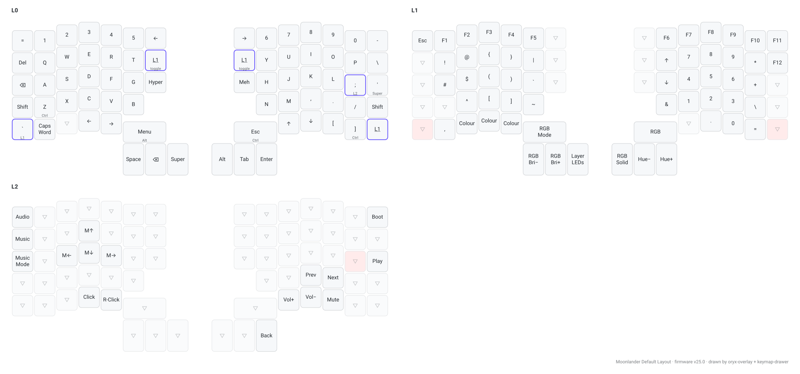

# Moonlander Default Layout

Oryx layout `default` · revision `x9m4dK` · firmware v25.0

> Generated by `make render` from `layout/keymap.c`. Do not edit by hand.
> `▽` = transparent (falls through), `·` = no key, `tap/hold` = dual role.
> Positions read `L2.3` = left half, row 2, fourth key from the left (all 0-based).



## Layer access

- **L0** (layer 0): base layer
- **L1** (layer 1): toggle key on L0 (L1.6); toggle key on L0 (R1.0); hold ` on L0 (L4.0); hold the layer key on L0 (R4.5)
- **L2** (layer 2): hold ; on L0 (R2.5)

## Lighting

RGB Matrix effects in this firmware, in RGB Mode cycle order (49): Solid Color, Alphas / Mods, Gradient Up/Down, Gradient Left/Right, Breathing, Band Saturation, Band Brightness, Pinwheel Saturation, Pinwheel Brightness, Spiral Saturation, Spiral Brightness, Cycle All, Cycle Left/Right, Cycle Up/Down, Rainbow Chevron, Cycle Out/In, Cycle Out/In Dual, Cycle Pinwheel, Cycle Spiral, Dual Beacon, Rainbow Beacon, Rainbow Pinwheels, Flower Blooming, Raindrops, Jellybean Raindrops, Hue Breathing, Hue Pendulum, Hue Wave, Pixel Rain, Pixel Flow, Pixel Fractal, Typing Heatmap, Digital Rain, Reactive Simple, Reactive, Reactive Wide, Reactive Multi-Wide, Reactive Cross, Reactive Multi-Cross, Reactive Nexus, Reactive Multi-Nexus, Splash, Multi-Splash, Solid Splash, Solid Multi-Splash, Starlight, Starlight Dual Sat, Starlight Dual Hue, Riverflow.

RGB Mode key: L1 L4.5.

Preview every effect on this board in `docs/index.html` (Lighting tab).

## Checks

- ⚠️ L0: 1 transparent key(s) on the base layer do nothing

## L0 (layer 0)

```text
[    =    ][    1    ][    2    ][    3    ][    4    ][    5    ][    ←    ]                          [    →    ][    6    ][    7    ][    8    ][    9    ][    0    ][    -    ]
[   Del   ][    Q    ][    W    ][    E    ][    R    ][    T    ][L1/toggle]                          [L1/toggle][    Y    ][    U    ][    I    ][    O    ][    P    ][    \    ]
[    ⌫    ][    A    ][    S    ][    D    ][    F    ][    G    ][  Hyper  ]                          [   Meh   ][    H    ][    J    ][    K    ][    L    ][   ;/L2  ][ '/Super ]
[  Shift  ][  Z/Ctrl ][    X    ][    C    ][    V    ][    B    ]                                                [    N    ][    M    ][    ,    ][    .    ][    /    ][  Shift  ]
[   `/L1  ][Caps Word][    ▽    ][    ←    ][    →    ][ Menu/Alt]                                     [ Esc/Ctrl]           [    ↑    ][    ↓    ][    [    ][  ]/Ctrl ][    L1   ]
                                                       [  Space  ][    ⌫    ][  Super  ]    [   Alt   ][   Tab   ][  Enter  ]
```

| Pos | Legend | Keycode |
|---|---|---|
| L1.6 | L1/toggle | `TG(1)` |
| R1.0 | L1/toggle | `TG(1)` |
| R2.5 | ;/L2 | `LT(2, KC_SCLN)` |
| R2.6 | '/Super | `MT(MOD_LGUI, KC_QUOTE)` |
| L3.1 | Z/Ctrl | `MT(MOD_LCTL, KC_Z)` |
| L4.0 | `/L1 | `LT(1, KC_GRAVE)` |
| L4.5 | Menu/Alt | `MT(MOD_LALT, KC_APPLICATION)` |
| R4.0 | Esc/Ctrl | `MT(MOD_LCTL, KC_ESCAPE)` |
| R4.4 | ]/Ctrl | `MT(MOD_RCTL, KC_RBRC)` |

## L1 (layer 1)

```text
[   Esc   ][    F1   ][    F2   ][    F3   ][    F4   ][    F5   ][    ▽    ]                          [    ▽    ][    F6   ][    F7   ][    F8   ][    F9   ][   F10   ][   F11   ]
[    ▽    ][    !    ][    @    ][    {    ][    }    ][    |    ][    ▽    ]                          [    ▽    ][    ↑    ][    7    ][    8    ][    9    ][    *    ][   F12   ]
[    ▽    ][    #    ][    $    ][    (    ][    )    ][    `    ][    ▽    ]                          [    ▽    ][    ↓    ][    4    ][    5    ][    6    ][    +    ][    ▽    ]
[    ▽    ][    ▽    ][    ^    ][    [    ][    ]    ][    ~    ]                                                [    &    ][    1    ][    2    ][    3    ][    \    ][    ▽    ]
[    ▽    ][    ,    ][  Colour ][  Colour ][  Colour ][ RGB Mode]                                     [   RGB   ]           [    ▽    ][    .    ][    0    ][    =    ][    ▽    ]
                                                       [ RGB Bri−][ RGB Bri+][Layer LE…]    [RGB Solid][   Hue−  ][   Hue+  ]
```

## L2 (layer 2)

```text
[  Audio  ][    ▽    ][    ▽    ][    ▽    ][    ▽    ][    ▽    ][    ▽    ]                          [    ▽    ][    ▽    ][    ▽    ][    ▽    ][    ▽    ][    ▽    ][   Boot  ]
[  Music  ][    ▽    ][    ▽    ][    M↑   ][    ▽    ][    ▽    ][    ▽    ]                          [    ▽    ][    ▽    ][    ▽    ][    ▽    ][    ▽    ][    ▽    ][    ▽    ]
[Music Mo…][    ▽    ][    M←   ][    M↓   ][    M→   ][    ▽    ][    ▽    ]                          [    ▽    ][    ▽    ][    ▽    ][    ▽    ][    ▽    ][    ▽    ][   Play  ]
[    ▽    ][    ▽    ][    ▽    ][    ▽    ][    ▽    ][    ▽    ]                                                [    ▽    ][    ▽    ][   Prev  ][   Next  ][    ▽    ][    ▽    ]
[    ▽    ][    ▽    ][    ▽    ][  Click  ][ R-Click ][    ▽    ]                                     [    ▽    ]           [   Vol+  ][   Vol−  ][   Mute  ][    ▽    ][    ▽    ]
                                                       [    ▽    ][    ▽    ][    ▽    ]    [    ▽    ][    ▽    ][   Back  ]
```
